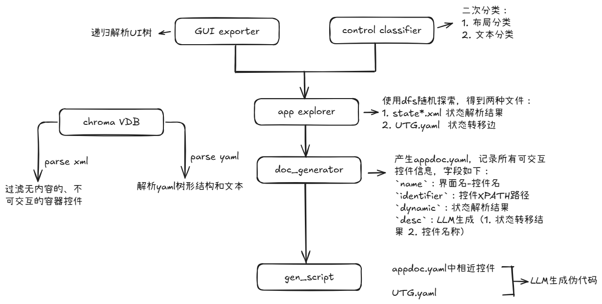

# AutoChat

## Features

- 针对微信平台，支持将GUI解析为XML结构
- 获取屏幕截图，截图为所有滚动结束后的最终界面
- 支持识别可滚动控件`ListBox`，并将`ListBox`的中的所有条目滚动到可见区域并解析
- 支持微信app随机探索，自动记录每个状态以及状态转移边
- 根据UTG生成app-specific的文档，并将动态控件抽象为模板
- 将本地app解析结果进行数据提取和分割，存储在本地chroma向量数据库中
- 支持gradio可视化demo

## Structure

```
  .  
  ├── doc----------------------（auto-gen 微信解析结果）  
  ├── script-------------------（手工任务执行脚本）  
  ├── tasks--------------------（任务执行结果）
  ├── utils----------------------------（工具类）
  |     ├── classifier.py-----------------（控件分类器）   
  |     ├── connector.py------------------（微信连接接口）
  |     ├── data_proc.py------------------（向量数据库处理）
  |     ├── doc_generator.py--------------（生成微信app doc）
  |     ├── explorer.py-------------------（微信随机探索工具）
  |     ├── gui_tree_exporter.py----------（GUI解析器）
  |     └── logger_config.py--------------（日志器配置）
  ├── README.md
  └── main.py
```



## NOTE

根据动态控件识别和抽象的目的，本项目将静动态控件分类分为两步：
1. 可交互控件识别：只有当一个控件是可交互控件，那么讨论其为静态控件还是动态控件才有意义。可交互控件包括Button，ListItem，Edit等
2. 批量同构控件识别：若在一个GUI容器中（例如ListBox，GroupBox），存在多项结构重复的控件（Button，ListItem），那么这一批控件就有可能是动态控件
3. 内容分类：根据一批同构控件的文本内容进行分类，如果其文本内容包含足够的功能信息，且功能各不相同，那么这一批控件仍然是静态控件（例如‘最大化’，‘最小化’，‘关闭’等），否则这一批控件是动态控件（例如‘好友1 消息1’，‘好友2 消息2’，‘好友3 消息3’等）

## TODO

- [x] 构造完成不同任务的状态转移序列
- [x] 动态控件识别
- [x] 构建穷尽式UTG app状态转移序列
- [x] 重叠状态判断方法存在bug
- [x] 将动态控件类型抽象为模板，得到APP Doc
- [x] 调用大语言模型，使其能够根据‘任务’和‘文档’生成正确的任务脚本
- [x] `ListItem`控件的`depth`解析始终为0，待修复
- [x] 对`ListItem`的XML解析中，child误解为JSON，待修复
- [x] utg中状态文件路径存在错误（相对路径），待修复

## Vulnerabilities

1. 对于动态控件分类中的第二次文本分类，根据可交互控件的文本内容进行分类仍存在误导性，例如在会话列表中存在联系人叫做“最大化”，“最小化”，“退出”等，那么这些控件仍然会被错误的归类为静态控件
2. explorer随机探索程序由于不能做到很好的状态回退，因此对控件的DFS探索存在偏差，导致算法不能正确运行完
3. doc_generator模块中的动态控件抽象，对动态控件的命名采用LLM生成，目前LLM只能根据一个动态控件的数据进行生成，样本太少
4. doc_generator模块中对一个状态/界面的功能总结时，将整个界面的xml解析/结果传输给LLM，存在无用UI信息过多、token数量过大而造成的无法解析问题
5. 成本缺陷，全部使用gpt-4.1模型进行分类和生成